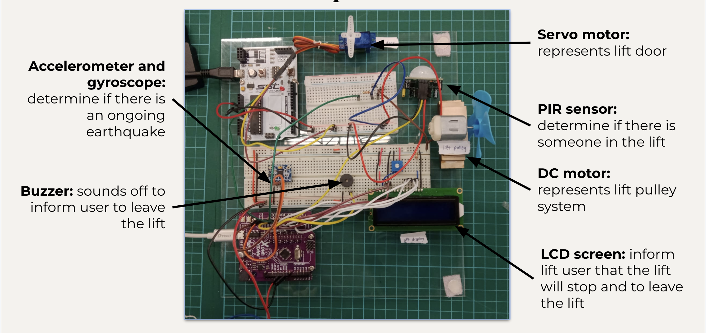

# Group 3 big D project 2023

## Problem

The problem we want to tackle is the safety of lift users in emergencies such as earthquakes.

According to research from the University of Colorado Boulder, it is estimated that a magnitude 7 earthquake may cause 22,000 people to be trapped between floors in 4,500 lifts that lack emergency power. Therefore, a system which can inform and save people stuck in lifts during earthquakes will be crucial.

## Concept

When the accelerometer and gyroscope detects irregular movement of the lift due to a possible earthquake, it will move the user to the nearest floor of the building, stop the lift and open the door, displaying a message that an earthquake is occurring. This will prompt the user to leave quickly, without being trapped in the lift due to reasons like power outages.

## System design

The accelerometer will track the vertical speed of the lift and monitor it by storing it. While the gyroscope will do the same for the angular velocity. When an extreme value is obtained, the motors will move the user to the next level and halt. The LCD screen will show a warning message and the speaker will tell the users to leave the lift.

### Materials

1. **Accelerometer:** to track and monitor up and down velocity of lift
2. **Gyroscope:** to track angular velocity to monitor shakiness of lift
3. **PIR sensor:** determine whether there is someone in the lift
4. **DC Motor:** to represent the activated pulley system of the lift turning on or off
5. **Servo Motor:** to represent the lift doors opening or closing
6. **LCD screen:** inform lift user that the lift will stop and to leave the lift
7. **Buzzer:** inform lift user to leave the lift

